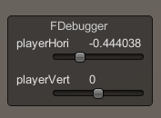

# FDebugger 

A single visualization tool to debug floats in Unity.

## Usage
1. Assign `FDebugger.cs` to a gameobject.
2. Call FDebugger.Singleton.inspect() on the float variable you are interested in from any where in your script.

```
void inspect(string float_name, float value, float lowerBound = 0.0f, float upperBound = 1.0f)
    Input:
        float_name: (string) variable name to display.
        value:      (float) float variable to inspect/visualize.
        lowerBound: (float) lower bound for inspected float variable, default to 0.0
        UpperBound: (float) upper bound for inspected float variable, default to 1.0
```

Example:
```
    // In the script where your variable in question lives.
    
    ...

    void Update()
    {
        horizontalInput = Input.GetAxis("Horizontal");
        verticalInput = Input.GetAxis("Vertical");
        FDebugger.Singleton.inspect("playerHori", horizontalInput, -1, 1);
        FDebugger.Singleton.inspect("playerVert", verticalInput, -1, 1);
    }
```



# Credit

Idea from [David Goedicke](https://github.com/DavidGoedicke).
